# 003 天天基金分析可视化系统-毕业设计展示

#### 介绍

> **代码有偿获取 可接受定制 微信联系方式: csbysj2020 或 ACE2487，备注(码云 毕设)**

> 

> 

## 技术栈

python django requests vue element-plus 天天基金 东方财富

实现的功能:
	1. 用户的注册登陆模块(包括后台权限管理,限制非管理员身份登陆后台)
	2. 基金的筛选列表，可根据基金类型、基金业绩表现、基金所属主题，进行基金的筛选
	3. 基金的关键词搜索，可根据基金代码、名称、简拼，进行搜索
	4. 基金的详细信息，包括估值、净值，分段收益、基金公司等相关信息
	5. 基金的净值走势图、基金的累计收益率走势以及与同类平均、沪深300的对比
	6. 基金的历史净值列表
	7. 可自选多个基金进行比较基本信息、历史收益、走势图

1. 爬虫技术，分析天天基金网站接口、实现模拟数据抓取
2. 后端技术，利用python的django框架搭建起后端接口，调取数据库的基金数据，以提供给前端展示
3. 前端技术，利用vue框架配合element-plus库，展示用户最终页面

## 视频

> **点击查看 \>\>\> [演示视频](https://www.bilibili.com/video/BV1xu411k7iH/)**

## 截图

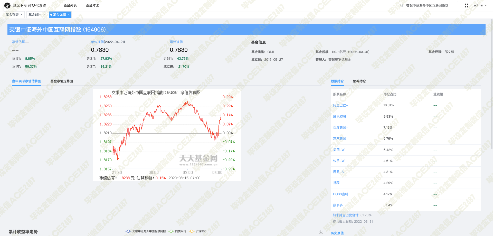
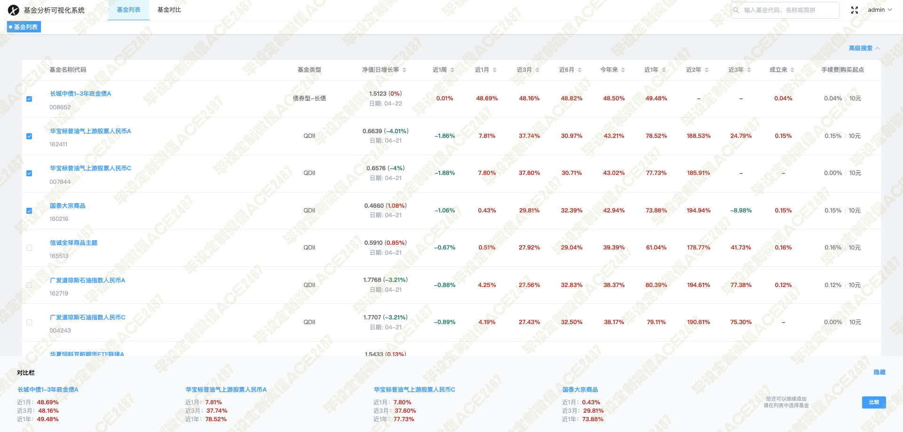
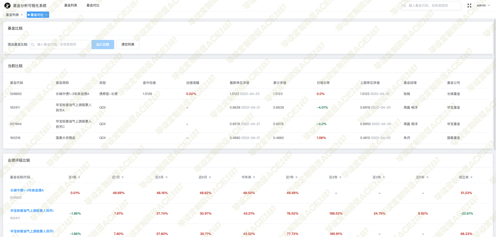
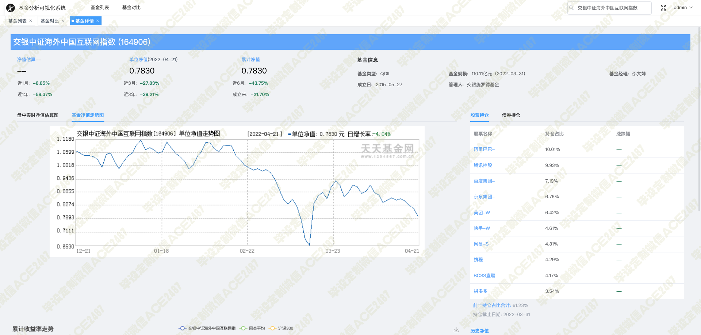
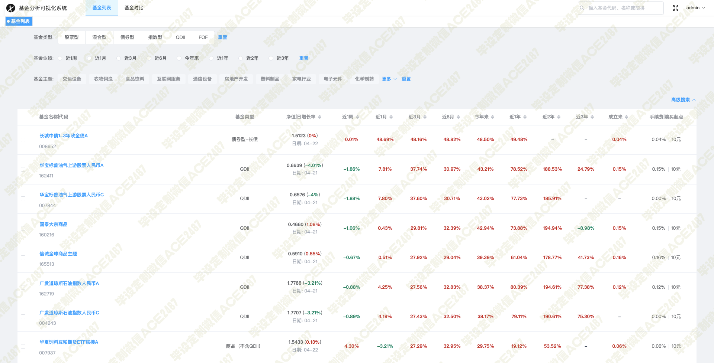
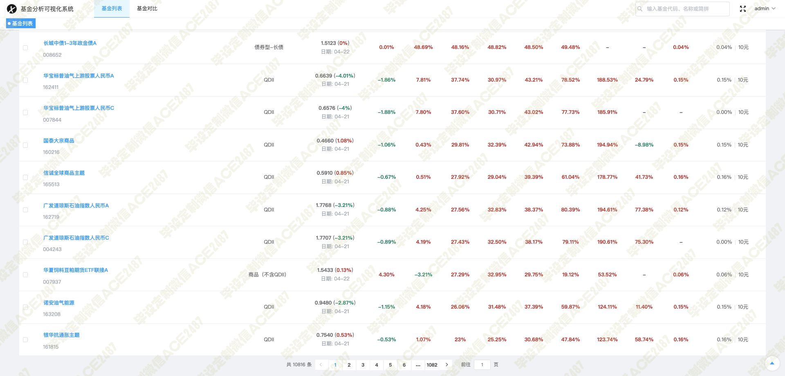
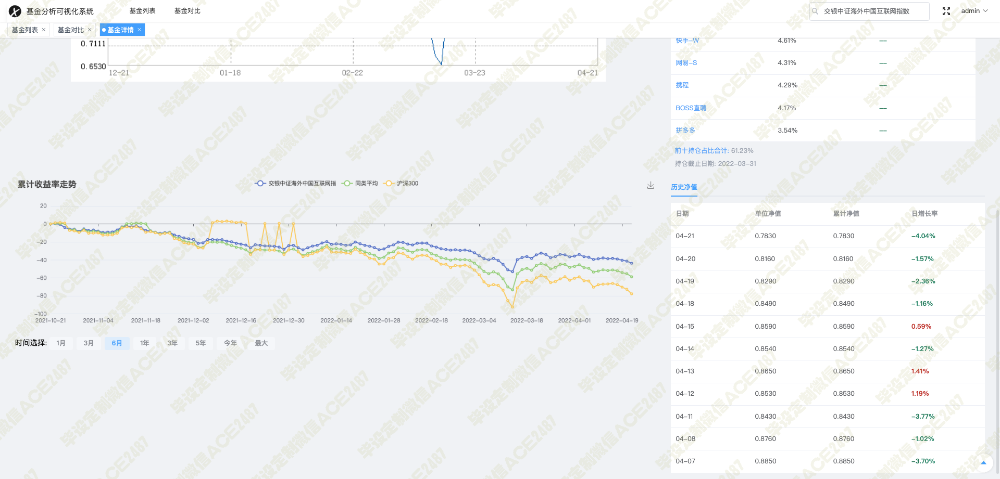
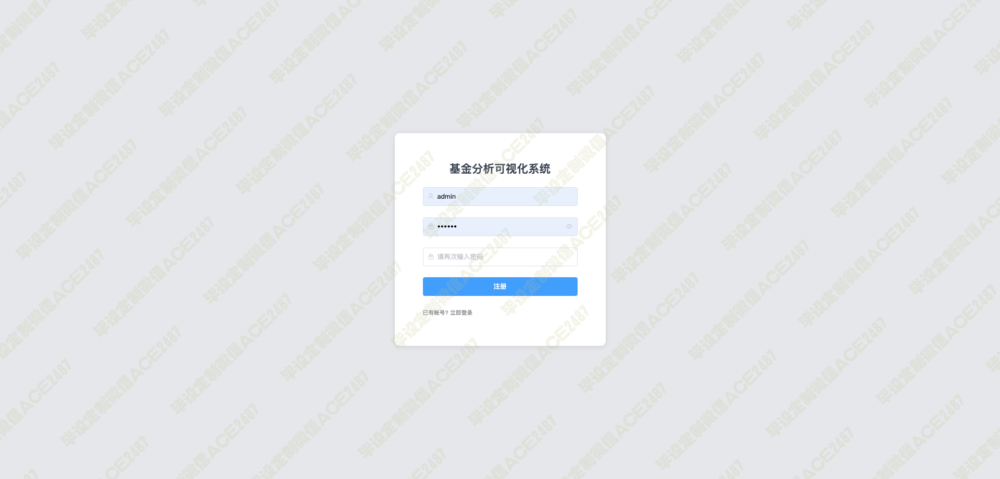
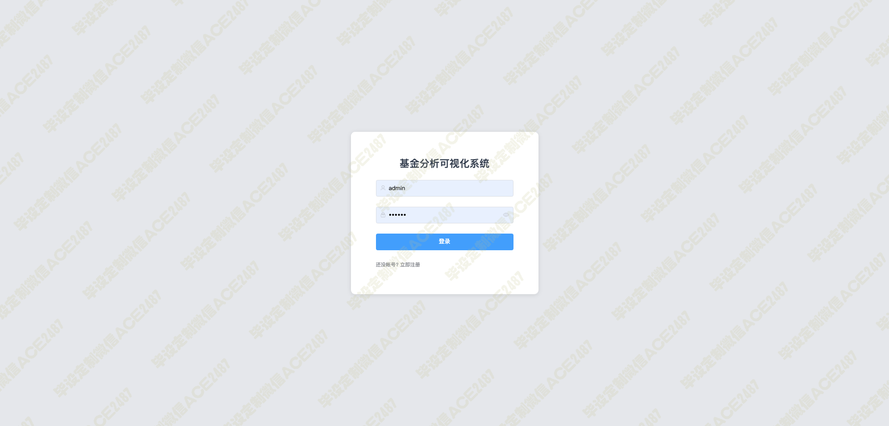
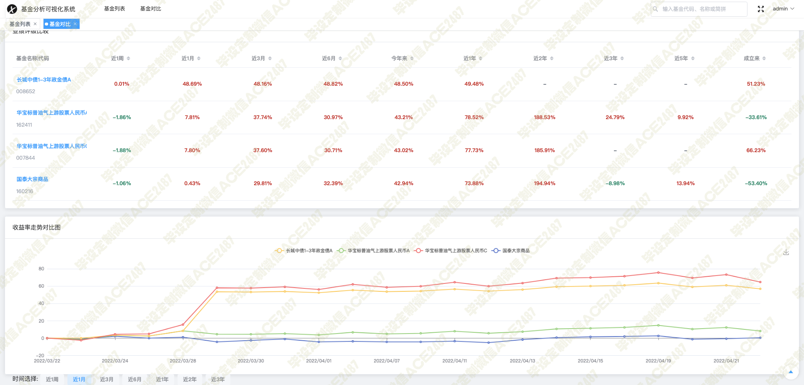
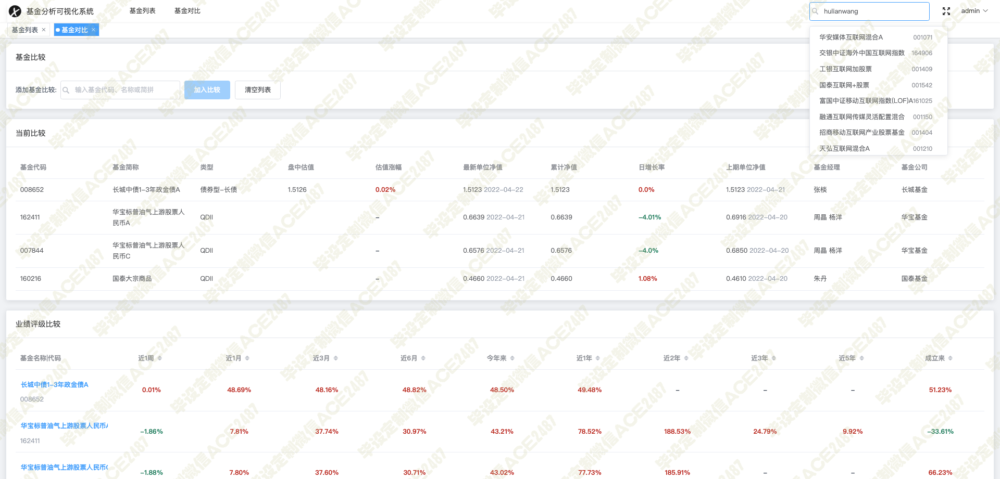